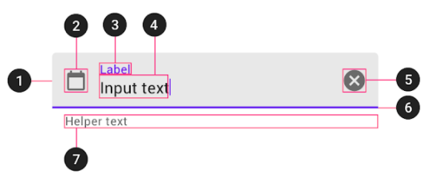
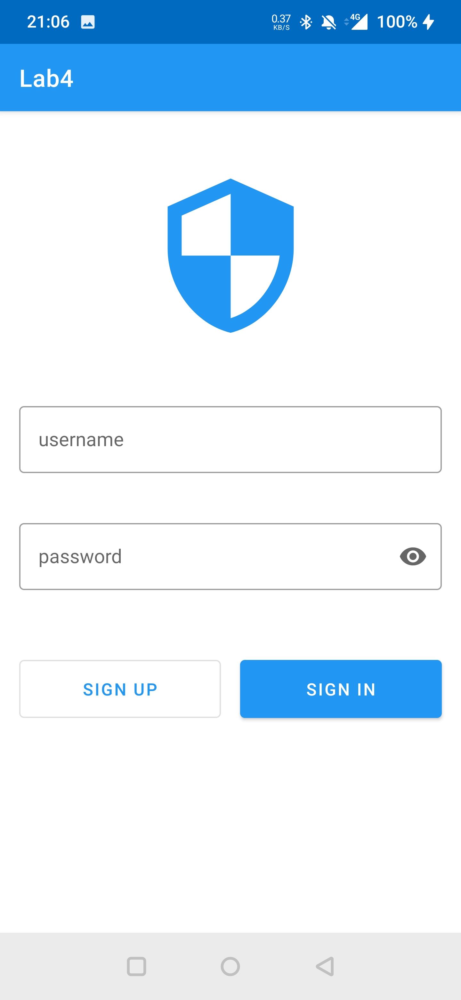
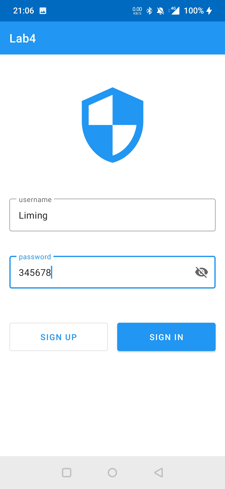
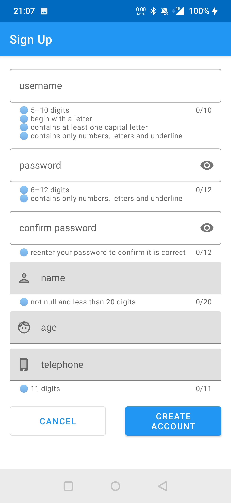
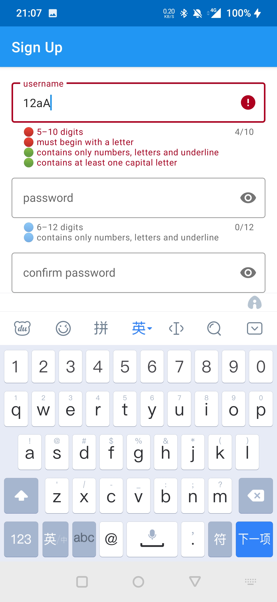
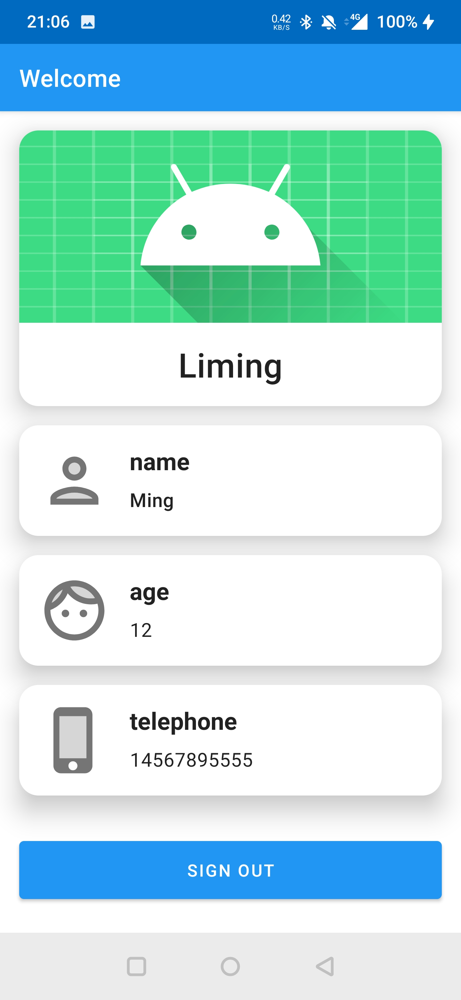

# hello_JAVA

[TOC]

# 1 引言

```
└─Lab4
   ├─client
   ├─server (1.0)
   └─server-ssm (2.1)
```

## Lab4 历史版本

客户端在最初版完成后基本没有大的改变，以下为服务端的历史版本

| 版本 | 时间       | 说明                                             |
| ---- | ---------- | ------------------------------------------------ |
| v1.0 | 2021.10.25 | 用最基础的 JavaWeb 技术实现                      |
| v2.0 | 2022.01.25 | 升级为 ssm （Spring + Spring Mvc + MyBatis）框架 |
| v2.1 | 2022.01.28 | 使用 Lombok                                      |

# 2 服务器模块（1.0）

## 2.1 Maven

Maven可以用于管理和构建项目

这里我们用于导入包和其依赖，并将项目打包为war包

导入MySQL的连接、连接池、servlet等包

```xml
<dependencies>
        <!-- https://mvnrepository.com/artifact/mysql/mysql-connector-java -->
        <dependency>
            <groupId>mysql</groupId>
            <artifactId>mysql-connector-java</artifactId>
            <version>8.0.26</version>
        </dependency>
        <!-- https://mvnrepository.com/artifact/com.alibaba/druid -->
        <dependency>
            <groupId>com.alibaba</groupId>
            <artifactId>druid</artifactId>
            <version>1.2.6</version>
        </dependency>
        <!-- https://mvnrepository.com/artifact/commons-dbutils/commons-dbutils -->
        <dependency>
            <groupId>commons-dbutils</groupId>
            <artifactId>commons-dbutils</artifactId>
            <version>1.7</version>
        </dependency>
        <!-- https://mvnrepository.com/artifact/mysql/mysql-connector-java -->
        <dependency>
            <groupId>javax.servlet</groupId>
            <artifactId>javax.servlet-api</artifactId>
            <version>3.1.0</version>
            <scope>provided</scope>
        </dependency>
        <!-- https://mvnrepository.com/artifact/commons-beanutils/commons-beanutils -->
        <dependency>
            <groupId>commons-beanutils</groupId>
            <artifactId>commons-beanutils</artifactId>
            <version>1.9.4</version>
        </dependency>
        <!-- https://mvnrepository.com/artifact/com.google.code.gson/gson -->
        <dependency>
            <groupId>com.google.code.gson</groupId>
            <artifactId>gson</artifactId>
            <version>2.8.5</version>
        </dependency>

        <dependency>
            <groupId>org.junit.jupiter</groupId>
            <artifactId>junit-jupiter-api</artifactId>
            <version>5.8.1</version>
        </dependency>
    </dependencies>
```

设置打包方式

```xml
<packaging>war</packaging>
```

## 2.2 pojo

包含user和person类

类中有无参构造函数、所有属性的get和set方法，并重写toString方法

## 2.3 Util

包含数据库连接工具和请求参数自动填充JavaBean工具

数据库连接工具导入配置文件并使用druid连接池，使用连接池后获取连接时从连接池中获得，不需要每次都新建

创建数据库连接池：

```java
private static DataSource dataSource;

static {
    try {
        Properties props = new Properties();
        InputStream inputStream = JdbcUtils.class.getClassLoader().getResourceAsStream("jdbc.properties");
        props.load(inputStream);
        dataSource = DruidDataSourceFactory.createDataSource(props);
    } catch (Exception e) {
        e.printStackTrace();
    }
}
```

## 2.4 dao

数据的持久化层

BaseDAO类为抽象类，实现基础的增删改查，具体实现调用DBUtil工具包

LabDAO类继承BaseDAO类，具体实现对user表和person表的操作

BaseDAO类中的多条结果查询方法：

```java
public static <T> List<T> queryForList(Connection conn, Class<T> clazz, String sql, Object... params) {
    List<T> list = null;
    try {
        list = queryRunner.query(conn, sql, new BeanListHandler<>(clazz), params);
    } catch (Exception e) {
        e.printStackTrace();
    }
    return list;
}
```

## 2.5 service

仅仅是对LabDAO的各个方法的调用

## 2.6 web

包含BaseServlet和LabServlet类

BaseServlet类为抽象类，继承自HttpServlet类，重写doGet和doPost方法，并将get请求都转为post请求处理

LabServlet类继承自BaseServlet类，实现对各种请求的处理

网页的请求参数在BaseServlet类中可以通过**反射机制**选择相应子类中的相应声明的方法处理

```java
String action = req.getParameter("action");
try {
    Method method = this.getClass().getDeclaredMethod(action, HttpServletRequest.class, HttpServletResponse.class);
    method.invoke(this, req, resp);
} catch (Exception e) {
    e.printStackTrace();
}
```

# 3 APP 模块

## Activity

包含MainActivity、SignUpActivity和WelcomeActivity

分别用于登录界面、注册界面和登录成功后的欢迎界面

## onBackPressed

重写onBackPressed方法，需要两秒内按两次返回键才能触发动作

## Volley

Volley 是一个可让 Android 应用更轻松、（最重要的是）更快捷地联网的 HTTP 库

用该库进行发送请求和接收响应

如下实现登录请求并接收服务端的响应。我们使用参数**StringRequest**，其中包括请求方式和url，其中的响应监听器可以让我们根据服务端返回的结果做进一步处理。在参数**getParams**中则是我们要请求发送的参数。

```java
public void signIn(View view) {
        final String TAG = "signIn";
        RequestQueue requestQueue = Volley.newRequestQueue(this);
        requestQueue.cancelAll(TAG);
        StringRequest stringRequest = new StringRequest(
                Request.Method.POST,
                "http://1.14.248.67:8080/Lab4/labServlet?action=signIn",
                new Response.Listener<String>() {
                    @Override
                    public void onResponse(String response) {
                        JSONObject jsonObject = null;
                        try {
                            jsonObject = new JSONObject(response);

                            if (jsonObject.getString("result").equals("success")) {
                                Intent intent = new Intent(MainActivity.this, WelcomeActivity.class);
                                intent.putExtra("username", usernameEditText.getText().toString());
                                startActivity(intent);
                                finish();
                            } else {
                                Toast.makeText(MainActivity.this, jsonObject.getString("result"), Toast.LENGTH_SHORT).show();
                            }
                        } catch (Exception e) {
                            e.printStackTrace();
                        }
                    }
                }, new Response.ErrorListener() {
            @Override
            public void onErrorResponse(VolleyError error) {
            }
        }) {
            @Override
            protected Map<String, String> getParams() {
                Map<String, String> map = new HashMap<>();
                map.put("username", usernameEditText.getText().toString());
                map.put("password", passwordEditText.getText().toString());
                return map;
            }
        };
        stringRequest.setTag(TAG);
        requestQueue.add(stringRequest);
    }
```

## Text fields

> 

官方提供的Text field包含许多部件并提供许多操作方法，便于编程和提高APP用户的使用体验

如下为在注册用户名部分该控件所设置的属性

counterEnabled counterMaxLength 计数

helperText helperTextEnabled 提示信息

其中许多属性和功能是普通输入框所没有的

```xml
<com.google.android.material.textfield.TextInputLayout
        android:id="@+id/username_layout_sign_up"
        style="@style/Widget.MaterialComponents.TextInputLayout.OutlinedBox"
        android:layout_width="match_parent"
        android:layout_height="wrap_content"
        android:layout_marginStart="@dimen/default_padding"
        android:layout_marginTop="@dimen/default_padding"
        android:layout_marginEnd="@dimen/default_padding"
        android:hint="@string/username"
        app:counterEnabled="true"
        app:counterMaxLength="10"
        app:errorEnabled="true"
        app:helperText="@string/username_helper_text"
        app:helperTextEnabled="true"
        app:layout_constraintEnd_toEndOf="parent"
        app:layout_constraintStart_toStartOf="parent"
        app:layout_constraintTop_toTopOf="parent">

        <com.google.android.material.textfield.TextInputEditText
            android:id="@+id/username_sign_up"
            android:layout_width="match_parent"
            android:layout_height="wrap_content"
            android:inputType="textVisiblePassword"
            android:singleLine="true" />

    </com.google.android.material.textfield.TextInputLayout>
```

## addTextChangedListener

加入该监听器并重写其中的方法，利用afterTextChanged方法实现输入后就立刻校验内容

在注册用户名部分结合上面的控件给出提示信息

```java
private boolean checkUsername() {
        String text = usernameEditText.getText().toString();
        int length = text.length();
        String pattern1 = "^[a-zA-Z].*$";
        String pattern2 = "^[\\w]*$";
        String pattern3 = ".*[A-Z].*";
        boolean hasError = false;
        String tips = "";
        if (length < 5 || length > 10) {
            hasError = true;
            tips += getString(R.string.username_error1) + "\n";
        } else {
            tips += getString(R.string.username_correct1) + "\n";
        }

        if (!Pattern.matches(pattern1, text)) {
            hasError = true;
            tips += getString(R.string.username_error2) + "\n";
        } else {
            tips += getString(R.string.username_correct2) + "\n";
        }

        ...

        if (hasError) {
            usernameLayout.setError(tips);
        } else {
            usernameLayout.setHelperText(tips);
        }
        return hasError;
    }
```

# 4 运行结果

## 登录

登录界面可以选择注册新账户或者直接登录

> 

密码可以选择可见和不可见两种状态

> 

## 注册

注册界面，提供实时校验并提示

> 
>
> 

## 欢迎

登录或者注册成功

>